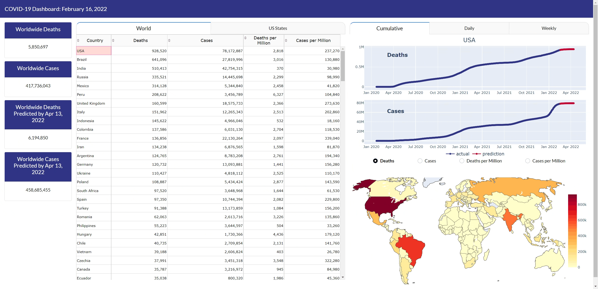

# Covid-Tracker

This is an interactive website that tracks, models and predicts COVID-19 Cases. 
The website http://mycoviddashboard.pythonanywhere.com/ is updated daily. 
We are using the John Hopkins DataSet that can be found at: https://github.com/CSSEGISandData/COVID-19

## Requirements

Pyhton 3.7 or above

## Installation of the packages

It is highly recommended that you create a virtual environment dedicated to this project.

  1. `cd` into the project directory
  2. Run the command `python -m venv dashboard_venv` to create the virtual environment
  3. Activate this virtual environment using one of the following commands
  4. Run `pip install -U pip` to upgrade pip to the latest version
  5. Run `pip install wheel` to install the wheel package, which helps install the other packages
  6. Run `pip install -r requirements.txt` to install all the necessary packages into this environment

## Launching the dashboard 

  1. `cd` into the project directory
  2. run `python update.py`
  3. run `python dashboard.py`

Input the address http://127.0.0.1:8050/, you should be able to see the dashboard. 
If error messages occur, try refreshing the page. 

## Quick Overview of the Website 

